# 어필리에이트 종단 흐름 V2

이 문서는 신청부터 지급·정정까지의 사용자 경험과 서버 증거 체인을 하나의 흐름으로 고정한다.

```mermaid
flowchart LR
  A[모집 페이지] --> B[신청서 작성]
  B --> C[정책 동의·제출]
  C --> D{관리자 심사}
  D -->|보완| B
  D -->|거절| X[종료·사유 안내]
  D -->|승인| E[1회용 초대·OTP]
  E --> F[파트너 세션 생성]
  F --> G[온보딩: 약관·채널·도메인·지급·세금]
  G --> H[판매 가능 상품 검색·저장]
  H --> I[게시 빌더: 채널·게시 위치·링크 형태]
  I --> J[테스트 클릭·검증]
  J --> K[외부 게시 URL 등록]
  K --> L[publication_id 클릭·귀속]
  L --> M[예약 attribution decision]
  M --> N[커미션 ledger snapshot]
  N --> O[정산 run HOLD/READY]
  O --> P[지급 요청·승인·증빙]
  P --> Q[COMPLETED]
  Q --> R[이후 취소는 reversal/revision]
```

## 파트너가 보는 화면 순서

1. `/partner/login`: 초대 링크·OTP로 세션을 만든다. 정적 PIN이나 localStorage 토큰은 사용하지 않는다.
2. `/partner/onboarding`: 완료율과 다음 할 일을 보여준다. 약관 동의, 채널·도메인, 지급·세금 검토, 첫 상품, 첫 게시를 각각 분리한다.
3. `/partner/products`: `active/approved/selling/available` 고객 노출 상태만 보여준다. API 오류와 실제 0건을 구분한다.
4. `/partner/publish`: 상품, 채널, 게시 위치 이름, 링크/카드/QR/콘텐츠를 입력한다. 저장 시 `publication_id`를 만든다.
5. `/partner/publications`: 테스트 클릭, 실제 게시 URL 등록, 링크 건강 상태를 확인한다.
6. `/partner/performance`·`/partner/bookings`: 클릭, 귀속 결정, 예약, 커미션 원장까지 같은 ID로 설명한다.
7. `/partner/earnings`·`/partner/settlements/[id]`: 발생액, 보류 사유, 지급 가능액, 지급 증빙, 이의제기를 보여준다.
8. `/partner/settings`: 버전별 정책 동의와 암호화된 지급·세금 정보 제출을 제공한다.

## 온보딩 완료 조건

| 항목 | 파트너 행동 | 완료 기준 |
|---|---|---|
| 필수 정책 | 네 문서에 한 번에 동의 | 불변 acceptance row 4건 |
| 채널 | 블로그·SNS 등 URL 등록 | 운영 검토 상태 표시 |
| 게시 도메인 | DNS 토큰 등록·검증 | `VERIFIED` 도메인 1개 이상 |
| 지급 정보 | 계좌 제출 | 암호화 저장 후 관리자 `VERIFIED` |
| 세금 정보 | 개인/사업자 식별정보 제출 | 암호화 저장 후 관리자 `VERIFIED` |
| 첫 상품 | 판매 가능 상품 저장 | `affiliate_saved_products` 1건 이상 |
| 첫 게시 | publication 생성·테스트 | `TESTED` 이상 1건 |
| 실제 게시 | 외부 URL 등록 | `PUBLISHED` 1건 이상 |

`PENDING_REVIEW`, `CHANGES_REQUIRED`, `HOLD`는 완료로 계산하지 않는다. 각 상태에는 재제출·재검토 경로와 사유가 있어야 한다.

## 정책과 권한 경계

- 파트너: 프로필, 채널, 도메인 요청, 게시 위치 이름, creator code 초안, 지급·세금 제출.
- 운영 검토: 채널·도메인·지급·세금 검증, 실제 할인 캠페인 승인, HOLD 해제.
- 관리자: 커미션 정책 버전, 귀속 우선순위, 최소 지급 기준, 정산 run, 지급 승인·증빙.
- 시스템: 예약 시점 rate/cap/policy snapshot, 불변 원장, 중복 방지, 세션 폐기, reversal.

creator code는 추천 귀속만 담당하며 고객 가격을 바꾸지 않는다. 가격을 낮추는 할인은 별도 `discount_campaigns`와 예약·결제·환불·원장 금액을 함께 가져야 한다.

## 실패 시 사용자 복구

- 승인 전 보완: 기존 입력값과 접수번호를 보존하고 필요한 항목만 다시 입력한다.
- 초대 만료: 새 1회용 초대를 발급한다. 기존 토큰은 재사용하지 않는다.
- 상품 0건: 품절·출발일 없음·가격 검수·정책 미완성 사유를 보여준다.
- 테스트 클릭 실패: publication 상태는 `DRAFT`에 남기고 코드·도메인·상품 오류를 수정한다.
- 예약 귀속 보류: attribution decision과 사유를 남기며 커미션은 `CALCULATION_HOLD`다.
- 정산 보류: 누락 자료와 SLA를 보여준다. 완료 정산을 VOID로 수정하지 않는다.
- 지급 후 취소: 원본 지급 증빙은 보존하고 음수 reversal과 revision을 만든다.

## 현재 남은 출시 전 확인

법무 문서의 실제 원문·해시, 최소 지급·세금·정산 가능 시점 정책, 지급 증빙 저장 위치는 운영 책임자가 확정해야 한다. 현재 구현의 문서 해시는 버전 식별용 안정값이며, 법무 원문이 확정되면 원문 바이트 해시로 교체해야 한다.
