# 어필리에이터 종단 계약 보완 결과

작성일: 2026-08-09  
브랜치: `affiliate-critical-remediation`  
범위: 신청 → 승인/초대 → 세션 → 상품 → 게시 위치 → 클릭 → 예약 귀속 → 커미션 → 정산 → 지급 → 정정

## 판정

운영 확대 전 반드시 막아야 하는 금액·인증·스키마 경계는 코드와 마이그레이션으로 보완했다. 운영 DB에 마이그레이션을 적용하거나 파트너 자격증명·정산 데이터를 변경하지는 않았다. 따라서 이 브랜치는 배포 후보이며, 운영 적용 전 수동 게이트가 남아 있다.

## 이번 브랜치에서 수정한 항목

| 영역 | 구현 결과 | 근거 |
|---|---|---|
| 신청 | `has_invite_code` 스키마 계약 제거/초대 FK 방향, 신청 중복·승인 트랜잭션·outbox | `20260808133613_affiliate_p0_application_contract.sql` |
| 인증 | 1회용 초대·OTP·`partner_session`·jti/session/token version·즉시 폐기 | `20260808135026_affiliate_auth_sessions_v2.sql` |
| PIN | 평문 PIN 로그인·발급 경로 제거, 기존 자격증명은 운영 회전 전까지 보존만 | auth API/검증 SQL |
| 도메인 | `PUBLIC_APP_ORIGIN` 단일 URL 빌더, 도메인 DNS TXT 소유권 확인 API | `src/lib/public-app-origin.ts`, partner domains API |
| 콘텐츠 | GET도 세션·파트너 격리, DB 오류를 외부에 노출하지 않음 | `/api/influencer/content` |
| 커미션 | 상품+등급+캠페인 정책의 단일 계산 서비스, 필수 7% cap, 정책 실패 HOLD | `20260808141133_affiliate_commission_policy_v2.sql` |
| 프로모션 | 가격을 바꾸지 않는 creator code와 실제 할인 campaign/redemption 분리 | `20260808141909_affiliate_publication_attribution_v2.sql` |
| 게시/귀속 | `publication_id`를 링크·touchpoint·attribution decision·booking·원장까지 전달, 원자 카운터 | 같은 마이그레이션 및 `/go/[publicationId]` |
| 정산 | ledger/run/line/payout/revision/dispute, KST 기간, advisory lock, maker-checker, 역분개 | `20260808143735_affiliate_settlement_ledger_v2.sql` |
| 레거시 정산 | 자동 완료·VOID·레거시 쓰기 차단, 검증 전 읽기 전용 | settlements API/DB trigger |
| 포털 | `/partner` 단일 경험, 온보딩 8단계, 카탈로그·게시·성과·예약·정산·설정 | `src/app/partner/**` |
| 지표 | 실제 bookings 기반 추이, `data_unavailable`와 빈 결과 분리, `total_revenue` 오표기 제거 | dashboard service/overview API |

## 데이터 흐름

```mermaid
flowchart LR
  A[신청] --> B[관리자 승인 + 초대 outbox]
  B --> C[OTP 활성화]
  C --> D[revocable partner_session]
  D --> E[판매 가능 카탈로그]
  E --> F[affiliate_publications]
  F --> G[짧은 URL /go/publication_id]
  G --> H[affiliate_touchpoints]
  H --> I[attribution_decisions]
  I --> J[booking attribution snapshot]
  J --> K[commission_ledger_entries]
  K --> L[settlement_lines freeze]
  L --> M[payout evidence]
  M --> N[reversal/revision only]
```

## 운영 전 남은 게이트

- 원격 마이그레이션 적용 후 `db/validate_affiliate_*.sql` 결과 확인
- 운영 파트너 7건의 평문 PIN 회전 및 기존 세션 폐기
- 실제 정책 담당자가 정산 정책 버전을 승인하기 전까지 정산 생성은 HOLD/실패가 정상
- 계좌·세금 제출 보안 절차와 약관 문서 버전 발행
- DNS TXT 전파 및 실제 외부 게시 URL 등록
- Playwright 로그인 → 상품 저장 → 테스트 클릭 → 게시 URL 등록 수동 확인
- Supabase CLI lint/dry-run은 로컬 Docker/Postgres가 실행 가능한 환경에서 재실행
