# 여소남 OS — 자비스 10년 아키텍처 (2026-2036)

> **문서 상태:** v1.0 · 2026-05-24  
> **작성 목적:** 10년을 내다본 자비스 시스템의 진화 로드맵. 사장님 의사결정 지원 + 구현자 참고 자료  
> **참조:** `db/JARVIS_V2_DESIGN.md`, `docs/jarvis-orchestration.md`, `docs/platform-ai-roadmap.md`

---

## 목차

1. [현재 상태 진단 (2026.05 기준)](#1-현재-상태-진단-202605-기준)
2. [10년 아키텍처 비전 (V3 → V5)](#2-10년-아키텍처-비전-v3--v5)
3. [세부 구현 계획 (Phase 0~9)](#3-세부-구현-계획-phase-09)
4. [기술적 의사결정 로그](#4-기술적-의사결정-로그)
5. [위험 및 완화 전략](#5-위험-및-완화-전략)
6. [비용-효용 분석](#6-비용-효용-분석)

---

## 1. 현재 상태 진단 (2026.05 기준)

### 1-1. V2 아키텍처 다이어그램

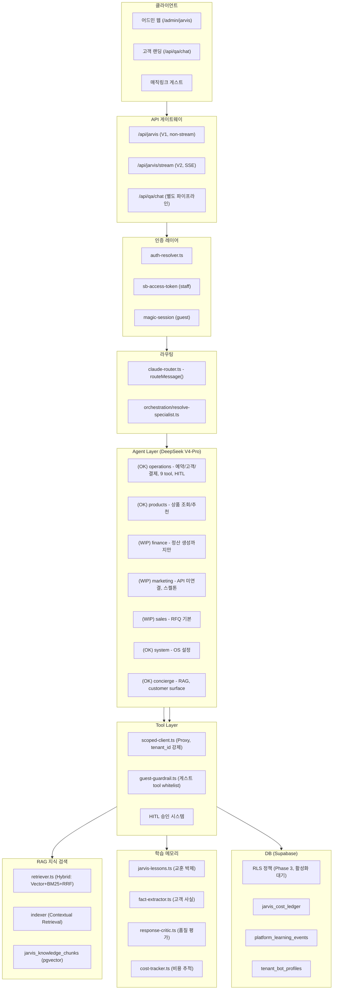

**현재 엔진:** DeepSeek V4-Pro (2026-05-01 Gemini → DeepSeek 전환 완료)  
**스트리밍:** V2 SSE (`/api/jarvis/stream`) 지원  
**멀티테넌트:** Phase 3 RLS 정책 등록 완료, 아직 활성화 전  
**RAG:** Contextual Retrieval + Hybrid Search 완료  
**게스트:** 매직링크 인증 + 가드레일 완료 (Air Canada Moffatt 대비)  
**학습:** Lessons + Admin Preferences + 누적 메모리 완료

### 1-2. Agent별 기능 매트릭스

| Agent | 상태 | Tool 수 | HITL | RAG | 실제 API | 비고 |
|-------|------|---------|------|-----|----------|------|
| **operations** | ✅ 완료 | 9 | ✅ | ❌ | ✅ | 예약/고객/결제 풀체인 |
| **products** | ✅ 완료 | 4 | ✅ | admin:❌ / customer:✅ | ✅ | surface 분기 |
| **finance** | 🟡 부분 | 3 | ✅ | ❌ | ✅ | 정산 생성만, 전송 미구현 |
| **marketing** | 🟡 부분 | 2 | ✅ | ❌ | ⏳ 미연결 | Meta/Naver/Google API 필요 |
| **sales** | 🟡 부분 | 2 | ✅ | ❌ | ✅ | RFQ 기본 |
| **system** | ✅ 완료 | 3 | ❌ | ❌ | ✅ | 정책/설정 |
| **concierge** | 🔵 신규 | 2 | ❌ | ✅ | ✅ | customer surface 전용 |
| **QA Chat** | 🔴 분리 | - | ❌ | ✅ | ✅ | `/api/qa/chat`, V2 미통합 |
| **register** | ❌ 미구현 | 0 | - | - | - | `/register` CLI만 존재 |
| **blog** | ❌ 미구현 | 0 | - | - | - | content-generator만 존재 |
| **ad/campaign** | ❌ 미구현 | 0 | - | - | - | 없음 |
| **review** | ❌ 미구현 | 0 | - | - | - | 없음 |
| **alert** | ❌ 미구현 | 0 | - | - | - | 없음 |

### 1-3. 데이터 흐름도

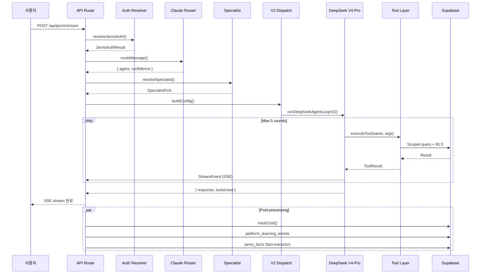

### 1-4. 보안/권한 체계

```mermaid
flowchart LR
    subgraph 계층1["Layer 1 - 인증 (Entry)"]
        Auth["auth-resolver.ts<br/>sb-access-token (staff)<br/>magic-session (guest)"]
    end

    subgraph 계층2["Layer 2 - 컨텍스트 (Middleware)"]
        Ctx["JarvisContext<br/>tenantId, userId, userRole, surface"]
    end

    subgraph 계층3["Layer 3 - Guardrail (프롬프트)"]
        GG["applyGuestGuardrail()<br/>Air Canada 패턴 방지<br/>단정문·직접실행 금지"]
    end

    subgraph 계층4["Layer 4 - Tool Scope (코드)"]
        SC["scoped-client.ts<br/>getScopedClient(ctx)<br/>.eq('tenant_id', ctx.tenantId) 강제"]
        FT["filterGuestTools()<br/>게스트는 mutating tool 차단"]
    end

    subgraph 계층5["Layer 5 - HITL (승인)"]
        HITL["requiresHITL() → 승인 대기<br/>jarvis_pending_actions 저장<br/>admin 승인 시 실행"]
    end

    subgraph 계층6["Layer 6 - RLS (DB)"]
        RLS["Supabase RLS<br/>tenant_isolation POLICY<br/>platform_admin bypass"]
    end

    계층1 --> 계층2 --> 계층3 --> 계층4 --> 계층5 --> 계층6
```

**6계층 방어선 구성:**
1. **인증**: staff는 `sb-access-token`, 게스트는 `magic-session` (HMAC 서명)
2. **컨텍스트**: `JarvisContext`에 tenantId/userRole/surface 강제 주입 (request body 스푸핑 차단)
3. **가드레일**: 게스트 모드에서 systemPrompt에 Air Canada 대비 프롬프트 가드레일 선주입
4. **Tool Scope**: 모든 agent tool은 `getScopedClient(ctx)`로 tenant_id 자동 필터
5. **HITL**: mutating tool은 `requiresHITL()` 게이트 → `jarvis_pending_actions` 저장 → 관리자 승인
6. **RLS**: DB 레벨 최종 방어선 (현재 등록 완료, 활성화 대기 중)


---

## 2. 10년 아키텍처 비전 (V3 → V5)

### 2-1. 3단계 진화 로드맵

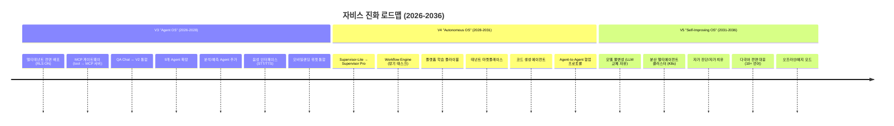

### 2-2. V3 — Agent OS (2026-2028)

**비전:** 자비스를 여소남 OS의 운영체제 수준으로 끌어올린다. 모든 기능이 agent를 통해 접근 가능하고, 테넌트별로 완전히 격리되며, 외부 AI가 표준 프로토콜(MCP)로 데이터를 조회할 수 있다.

**핵심 변경:**

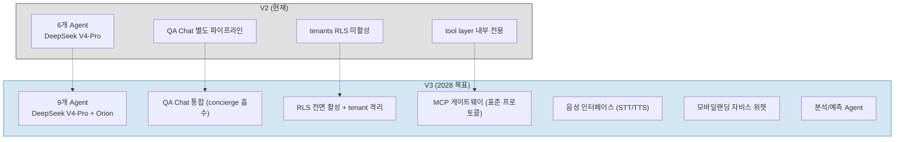

```mermaid
flowchart TB
    subgraph V3_ARCH["V3 "Agent OS" 상세"]

        subgraph Entry2["진입"]
            EN1["어드민 웹"]
            EN2["모바일랜딩 위젯"]
            EN3["음성 (STT/TTS 게이트웨이)"]
            EN4["MCP 클라이언트 (외부 AI)"]
        end

        subgraph Gateway["MCP 게이트웨이"]
            GW["MCP 서버<br/>tool layer → MCP 표준<br/>외부 AI가 도구로 호출"]
        end

        subgraph Router2["Supervisor"]
            SR["DeepSeek V4-Flash Router<br/>→ 9개 agent 분기<br/>confidence < 0.7 → 확인 질문"]
        end

        subgraph Agents_V3["9개 Agent (DeepSeek V4-Pro)"]
            direction TB
            AG1["operations (예약/고객/결제)"]
            AG2["products (상품 조회/추천)"]
            AG3["finance (정산 풀체인)"]
            AG4["register (상품 등록, /register 연동)"]
            AG5["blog (블로그 기안→발행)"]
            AG6["ad (광고 캠페인, Meta/Naver/Google)"]
            AG7["review (리뷰 수집/분석)"]
            AG8["alert (모니터링/알림)"]
            AG9["analytics (매출/수요 예측)"]
        end

        subgraph Concierge["통합 Concierge"]
            CO["QA Chat 흡수 완료<br/>RAG + 매직링크 + HITL<br/>guest/customer 전면 지원"]
        end

        subgraph RAG_V3["RAG 고도화"]
            RG1["테넌트별 namespace 완전 격리"]
            RG2["자동 재인덱싱 (상품/블로그 변경 시)"]
            RG3["다중 모델 reranker (Gemini Flash)"]
        end

        subgraph Learning_V3["학습 시스템"]
            LS1["Lessons 자동 생성 (incident → lesson)"]
            LS2["platform_learning_events 집계"]
            LS3["월간 품질 리포트"]
        end

        Entry2 --> SR
        SR --> Agents_V3
        SR --> Concierge
        Agents_V3 --> Gateway
        Agent_V3 --> RAG_V3
        Agent_V3 --> Learning_V3
        Gateway --> EN4
    end
```

#### V3 주요 변화

| 항목 | 현재 (V2) | V3 목표 |
|------|----------|---------|
| Agent 수 | 6개 | 9개 |
| QA Chat | 별도 파이프라인 | concierge agent로 통합 |
| 멀티테넌트 | RLS 등록, 비활성 | RLS ON, tenant별 완전 격리 |
| 외부 연동 | 내부 전용 | MCP 표준 프로토콜 |
| 음성 | 없음 | STT/TTS 게이트웨이 |
| 모바일랜딩 | 미연동 | 자비스 위젯 내장 |
| 마케팅 API | 스켈톤 | Meta/Naver/Google 연동 |

### 2-3. V4 — Autonomous OS (2028-2031)

**비전:** 자비스가 단순 명령 수행을 넘어 장기 플랜을 스스로 수립하고 실행한다. 테넌트 간 에이전트 거래가 가능하고, 플랫폼이 데이터를 먹고 스스로 성장한다.

```mermaid
flowchart TB
    subgraph V4_ARCH["V4 "Autonomous OS" 상세"]

        subgraph SuperPro["Supervisor Pro"]
            SP1["DeepSeek + Orion<br/>멀티모달 라우팅<br/>Task DAG 플래너"]
        end

        subgraph Workflow["Workflow Engine"]
            WE1["장기 태스크 오케스트레이션<br/>예: 블로그 기획→작성→검토→발행"]
            WE2["State machine 기반 (DB persisted)"]
            WE3["각 step: 다른 agent에 위임"]
        end

        subgraph Flywheel["학습 플라이휠"]
            FW1["Offline eval (golden set)"]
            FW2["A/B 테스트 인프라"]
            FW3["회귀 테스트 자동화"]
            FW4["품질 점수 → 모델/프롬프트 개선"]
        end

        subgraph Market["테넌트 마켓플레이스"]
            MK1["테넌트 전용 agent 등록/판매"]
            MK2["agent discovery + 평점"]
            MK3["플랫폼 수수료 (20%)"]
        end

        subgraph CodeAgent["코드 생성 에이전트"]
            CA1["SQL 마이그레이션 생성"]
            CA2["설정 변경 자동화"]
            CA3["보고서 생성 (HTML/PDF)"]
        end

        subgraph A2A["Agent-Agent 협업"]
            A2A1["MCP 기반 표준 프로토콜"]
            A2A2["비동기 메시지 큐 (PG Queue)"]
            A2A3["이벤트 구독/발행"]
        end

        SuperPro --> Workflow
        SuperPro --> Flywheel
        SuperPro --> Market
        SuperPro --> CodeAgent
        Workflow --> A2A
        CodeAgent --> A2A
    end
```

#### V4 주요 변화

| 항목 | V3 | V4 목표 |
|------|-----|---------|
| Supervisor | DeepSeek V4-Flash | DeepSeek + Orion 멀티모달 |
| 태스크 | 단발성 (5 round 제한) | Workflow Engine (수시간~수일) |
| 학습 | 수동 lesson 등록 | Offline eval + A/B + 자동 golden set |
| 생태계 | 폐쇄형 | 테넌트 마켓플레이스 오픈 |
| 코드 | 사람만 작성 | AI가 SQL/설정 생성 |
| 협업 | 단일 agent | Agent-to-Agent 프로토콜 |

### 2-4. V5 — Self-Improving OS (2031-2036)

**비전:** 자비스가 스스로를 진단하고, 스스로를 개선하고, 어떤 LLM 위에서도 동작한다. 인터넷이 끊겨도 기본 운영이 가능하고, 10개 이상 언어를 네이티브 수준으로 지원한다.

```mermaid
flowchart TB
    subgraph V5_ARCH["V5 "Self-Improving OS" 상세"]

        subgraph ModelAgnostic["모델 불변성"]
            MA1["추상화 계층 (LLM Loader)"]
            MA2["자체 Fine-tuning 파이프라인"]
            MA3["Golden set 기반 모델 평가"]
            MA4["Auto-switch: 성능↓ → 다른 모델"]
        end

        subgraph K8sCluster["분산 클러스터 (K8s)"]
            K1["Horizontal Pod Autoscaling"]
            K2["Agent별 독립 배포"]
            K3["테넌트별 리소스 쿼터"]
            K4["Canary 배포 + Rollback"]
        end

        subgraph SelfHeal["자가 진단/자가 치유"]
            SH1["에러 감지 (agent_incidents)"]
            SH2["root cause 분석 (LLM)"]
            SH3["패치 생성 → 테스트 → 배포"]
            SH4["사람 승인 옵션 (HITL 변형)"]
        end

        subgraph MultiLang["다국어 전면 대응"]
            ML1["10+ 언어 (한/영/일/중/베/태/...)"]
            ML2["번역 파이프라인 (RAG 문서)"]
            ML3["locale-aware agent prompt"]
        end

        subgraph EdgeMode["오프라인/에지 모드"]
            EM1["경량 모델 (Llama/Gemma) 에지 배포"]
            EM2["로컬 SQLite 캐시"]
            EM3["온라인 복구 시 동기화"]
            EM4["인터넷 없이 기본 예약 조회"]
        end

        ModelAgnostic --> K8sCluster
        K8sCluster --> SelfHeal
        ModelAgnostic --> MultiLang
        SelfHeal --> EdgeMode
    end
```

#### V5 주요 변화

| 항목 | V4 | V5 목표 |
|------|-----|---------|
| 모델 | DeepSeek 고정 | 모델 불변성 (자유 교체) |
| 배포 | 단일 서버 | K8s 네이티브 분산 클러스터 |
| 유지보수 | 사람 주도 | AI 자기 치유 |
| 언어 | 한글 + 영어 | 10+ 언어 |
| 의존성 | 항상 온라인 | 오프라인/에지 모드 지원 |


---

## 3. 세부 구현 계획 (Phase 0~9)

### Phase 0 — 멀티테넌트 자비스 전면 배포 (1-2주)

**목표:** RLS 활성화 + QA Chat 통합 + 모바일랜딩 위젯

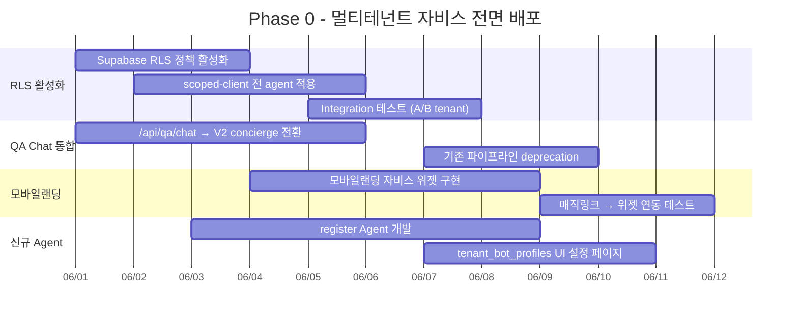

**세부 작업:**

| 작업 | 담당 파일 | 설명 |
|------|----------|------|
| RLS 활성화 | `supabase/migrations/` | `JARVIS_RLS_ENABLED=true` + RPC `set_request_context` 호출 |
| scoped-client 전 agent 적용 | `v2-dispatch.ts`, `agents/*.ts` | 모든 `executeTool`에 `getScopedClient(ctx)` 적용 |
| QA Chat V2 이관 | `src/app/api/qa/chat/route.ts` | `surface='customer'`로 V2 concierge agent 호출 |
| 모바일랜딩 위젯 | `src/components/jarvis/JarvisSidekick.tsx` | 모바일 최적화 + PWA 연동 |
| register Agent | `src/lib/jarvis/agents/register.ts` | `/register` CLI 로직 → 자비스 tool |
| tenant_bot_profiles UI | `src/app/admin/tenants/[tid]/bot/page.tsx` | 설정 페이지 마무리 |
| 테넌트 RAG namespace 분리 | `rag/retriever.ts` | `tenant_id` 파라미터 전달 검증 |

**예상 효과:**
- V2 기반이므로 인프라 변경 거의 없음
- QA Chat 통합으로 고객 문의가 자비스 학습 데이터에 포함됨
- register Agent로 상품 등록 절차 반자동화

### Phase 1 — MCP 게이트웨이 (2-3주)

**목표:** 자비스 tool layer를 표준 MCP 서버로 노출. 외부 AI(Claude, ChatGPT, Cursor)가 여소남OS 데이터 조회 가능.

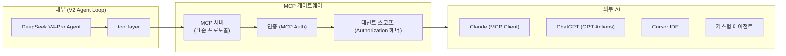

**세부 작업:**

| 작업 | 설명 |
|------|------|
| MCP 서버 구현 | `src/lib/jarvis/mcp-server.ts` (표준 MCP 스펙 준수) |
| tool 레지스트리 | 전 agent tool을 MCP tool 스키마로 변환 |
| 인증 | MCP 표준 auth + tenant 스코프 바인딩 |
| 마케팅 Agent API 연동 | Meta/Naver/Google Ads 실제 API 키 연결 |
| 신규 Agent: review | 리뷰 수집/분석/집계 tool |
| 신규 Agent: alert | 모니터링 알림 tool |

**MCP 서버 노출 범위 결정:**

| 스코프 | 노출 | 설명 |
|--------|------|------|
| 조회 tool | ✅ 전체 | 상품 조회, 예약 조회, 고객 조회 등 |
| 변경 tool | ⚠️ 조건부 | HITL 게이트 통과 + admin 승인 필요 |
| 금융 tool | ❌ 비노출 | 정산/결제 tool은 V2 Agent Loop 전용 |

### Phase 2 — 어드민 전 영역 명령 지원 (3-4주)

**목표:** 어드민의 모든 기능을 자비스 명령 한 줄로 실행 가능하게 함.

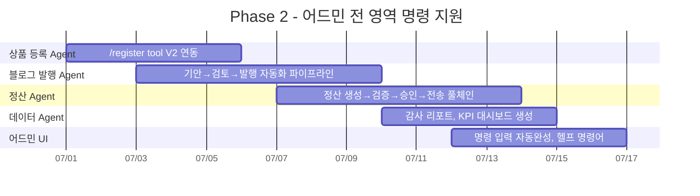

**세부 작업:**

| 작업 | 설명 |
|------|------|
| register Agent | `/register` CLI를 자비스 tool로 변환. 상품명/가격/일정 입력 → DB 저장. HITL 포함 |
| blog Agent | 블로그 기안 작성 → 내부 검토 → 발행까지 자동화. content-generator 연동 |
| finance Agent 확장 | 정산 생성 → 검증 → 승인(어드민) → 랜드사 전송까지 풀체인 |
| data Agent | `platform_learning_events` 기반 감사 리포트 생성. 차트/표 출력 |
| admin UI | 명령어 자동완성, `/help` 명령어, 최근 명령어 히스토리 |

**예상 효과:**
- 어드민 작업 시간 **50~70% 감소** (반복 작업 자동화)
- 블로그 발행 주기 **2배 이상 단축**

### Phase 3 — 매직링크 고도화 + 자비스 에이전트화 (2-3주)

**목표:** 매직링크가 단순 로그인을 넘어 고객의 모든 여정을 자비스가 관리하는 채널로 확장.

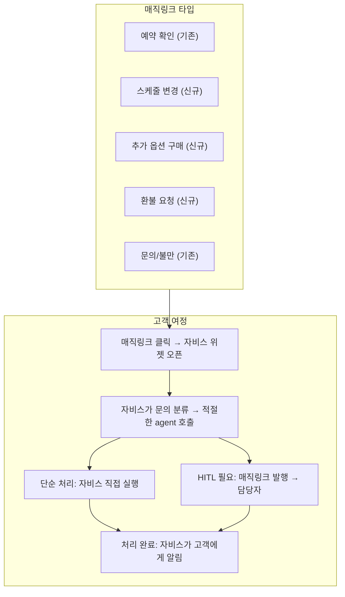

**세부 작업:**

| 작업 | 설명 |
|------|------|
| 매직링크 타입 확장 | 스케줄 변경, 추가 옵션, 환불 요청 등 magic_action_tokens 타입 추가 |
| JarvisSidekick 내장 | 모든 액션 페이지(예약 상세, 결제, 옵션)에 sidekick 기본 내장 |
| 자비스 매직링크 발행 | 자비스가 HITL 감지 시 자동으로 매직링크 생성 + 고객 SMS 발송 |
| 모바일 UI 최적화 | PWA 푸시 알림, 모바일 전용 레이아웃 |
| 에스컬레이션 자동 라우팅 | 자비스 → (HITL) → 담당자 처리 → 자비스 완료 통보 |

**에스컬레이션 플로우:**

```
고객: "예약 날짜를 바꾸고 싶어요"
  → 자비스: 규정 확인 + 변경 가능 여부 판단
    → 단순 변경 (정책 내): 자비스가 직접 변경 tool 호출 → 완료 안내
    → 복잡/고위험: HITL 트리거
      → 자비스가 매직링크 생성 + 담당자 알림
      → 담당자 처리 완료 → 자비스가 고객에게 완료 알림
```

### Phase 4 — 학습 플라이휠 가동 (3-4주)

**목표:** `platform_learning_events` 기반으로 자비스가 데이터를 먹고 스스로 성장하는 순환 구조 구축.

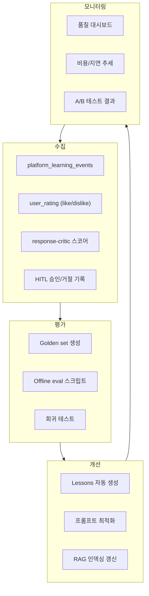

**세부 작업:**

| 작업 | 설명 | 파일 |
|------|------|------|
| golden set 생성 | `platform_learning_events`에서 양질 응답 추출 → golden set DB 구축 | `scripts/generate-golden-set.ts` |
| offline eval | golden set 기반 정기 평가 (응답 정확도, RAG precision/recall) | `scripts/offline-eval.ts` |
| A/B 테스트 | V1 vs V2, 모델 비교, 프롬프트 실험 | `v2-dispatch.ts` env flag 확장 |
| Lessons 자동화 | `agent_incidents` → `jarvis_lessons` 자동 변환 | `jarvis-lessons.ts` |
| 지식 인덱싱 자동화 | 상품/블로그 변경 시 Supabase webhook → 재인덱싱 트리거 | `db/rag_reindex_all.js` |
| 품질 대시보드 | 어드민에 응답 품질/비용/지연 통계 시각화 | `admin/jarvis/quality` |

**Golden set 품질 기준:**

| 항목 | 기준 | 측정 방법 |
|------|------|----------|
| 응답 정확도 | 95%+ | 사람 평가 (sampling) |
| RAG precision | 90%+ | golden set 기준 |
| RAG recall | 85%+ | golden set 기준 |
| HITL 적절성 | 90%+ | 승인율 모니터링 |
| 지연 시간 | p50 4s, p95 12s | cost-tracker |


### Phase 5+ — 미래 확장

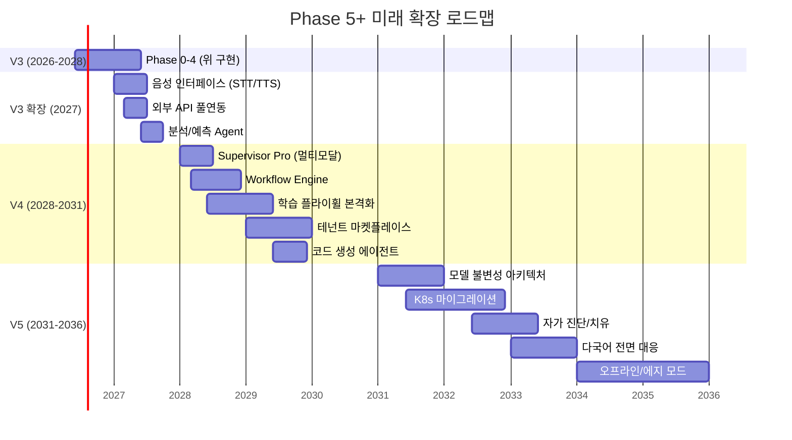

---

## 4. 기술적 의사결정 로그

### 결정 1: 프레임워크 vs 직접 구현

| 항목 | 결정 | 근거 |
|------|------|------|
| **사용 여부** | **직접 구현 유지** | 사장님 결정 (2026-05) |
| 비교 대상 | LangGraph (9% 오버헤드), CrewAI (18%), AutoGen (31%) | 우리 직접 구현 < 5% 목표 |
| 핵심 파일 | `deepseek-agent-loop-v2.ts` (line 78-341) | 단일 AsyncGenerator로 전체 루프 |
| 장점 | 경량, DeepSeek 최적화, 기존 코드 100% 활용, 의존성 최소 | - |
| 단점 | 생태계 도구 미활용, 표준 패턴 수동 구현 | 수용 |

**토큰 오버헤드 벤치마크 (2026년 기준):**

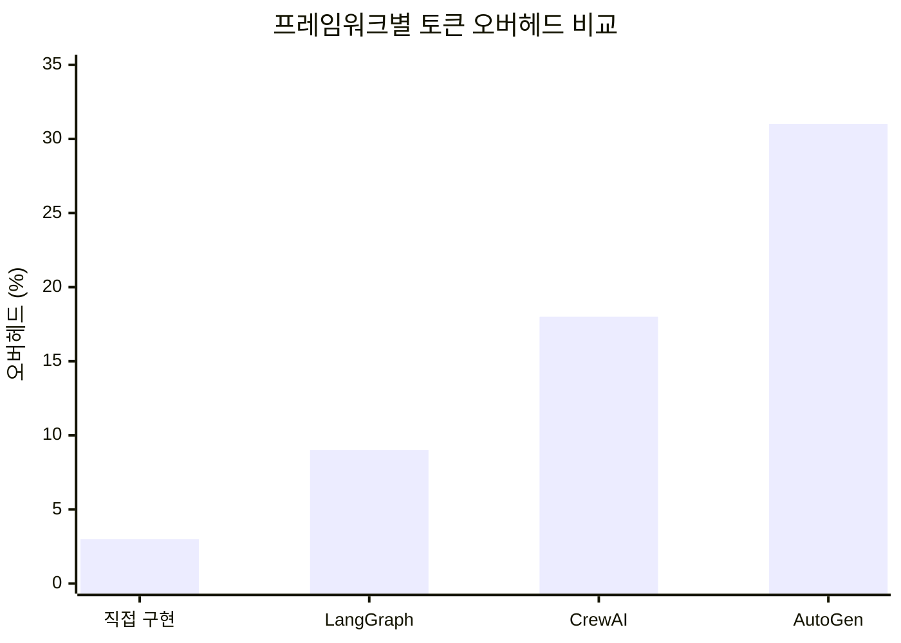

### 결정 2: 모델 전략

| 우선순위 | 모델 | 역할 | Fallback |
|---------|------|------|----------|
| **Primary** | DeepSeek V4-Pro | 모든 Agent Worker | Gemini 2.5 Pro |
| **Router** | DeepSeek V4-Flash | Supervisor 라우팅 | 없음 (저비용) |
| **Fallback** | Gemini 2.5 Flash | Primary 장애 시 | - |
| **Embedding** | Gemini Embedding 001 | RAG 임베딩 | 없음 |
| **Reranker** | Gemini 2.5 Flash | RAG 재순위 | BM25 only |

**전환 조건:**
- DeepSeek V4-Pro p50 latency > 8s → Gemini 2.5 Pro로 fallback
- DeepSeek API 장애 (5xx 연속 10회) → Gemini 2.5 Flash로 fallback
- 신규 모델 출시 시 2주간 golden set A/B 테스트 후 결정

### 결정 3: MCP 전략

| 항목 | 결정 |
|------|------|
| **프로토콜** | 표준 MCP (Model Context Protocol) 준수 |
| **노출 범위** | 조회 tool 전체 + 변경 tool 조건부 |
| **인증** | MCP 표준 Auth + Authorization 헤더에 tenant_id |
| **서버 구현** | `src/lib/jarvis/mcp-server.ts` (자체 구현, 프레임워크 없음) |
| **사용처** | 외부 AI (Claude/ChatGPT/Cursor)가 여소남OS 데이터 조회 |

### 결정 4: DB/벡터 전략

| 항목 | 결정 | 근거 |
|------|------|------|
| **벡터 DB** | Supabase pgvector 유지 | 기존 인프라, 0추가비용 |
| **테넌트 격리** | namespace (partial index on tenant_id) | 테넌트 < 100개면 효율적 |
| **shared-schema** | 유지 (shared db, shared schema, tenant_id 필터) | 운영 단순, RLS로 격리 |
| **인덱스** | HNSW (vector_cosine_ops) + GIN (BM25) | Hybrid 검색 성능 |

### 결정 5: LLM 게이트웨이

| 항목 | 현재 | 미래 옵션 |
|------|------|----------|
| **현재** | `llm-gateway.ts` (자체 구현) | 모델별 API 호출 추상화 |
| **V4 옵션** | Vercel AI SDK Adapter | 표준화된 provider 전환 |
| **V5 목표** | 자체 게이트웨이 + Fine-tuning | 완전한 모델 불변성 |

---

## 5. 위험 및 완화 전략

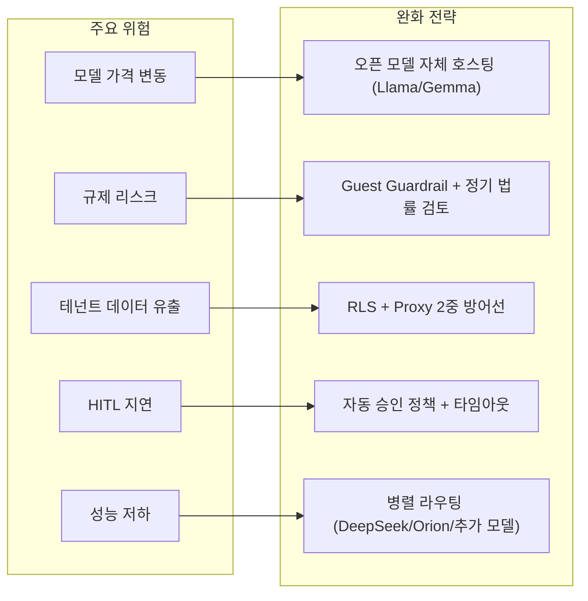

### 위험별 상세

| 위험 | 발생 가능성 | 영향 | 완화 | 우선순위 |
|------|-----------|------|------|---------|
| **모델 가격 변동** | 중 | 비용 2~5배 증가 | Llama/Gemma 등 오픈 모델 자체 호스팅 대비. golden set 기반 품질 검증 후 전환 | P1 |
| **규제 리스크 (Air Canada 패턴)** | 중 | 법적 책임 | Guest Guardrail 지속 개선. 법률 검토 연 1회. HITL 게이트 필수 | P0 |
| **테넌트 데이터 유출** | 낮음 | 치명적 | RLS + Proxy 2중 방어선. 침투 테스트 분기 1회. 로그 감사 | P0 |
| **HITL 지연으로 고객 이탈** | 중 | 사용자 경험 저하 | 자동 승인 정책 (저위험 작업). 타임아웃 30분 → 에스컬레이션. 대체 채널 안내 | P1 |
| **성능 저하 (트래픽 급증)** | 중 | 서비스 불가 | 병렬 모델 라우팅. DeepSeek/Orion/추가 모델 로드 밸런싱. Rate limiting | P1 |
| **Supabase RLS 오설정** | 중 | 서비스 중단 | 스테이징 검증 먼저. `JARVIS_RLS_ENABLED` env flag로 즉시 롤백 가능 | P0 |
| **Token Quota 초과** | 중 | 특정 테넌트 차단 | `assertQuota()`로 사전 차단. 관리자 알림. 쿼터 증설 프로세스 | P2 |

### 규제 대응 로드맵

| 연도 | 대응 |
|------|------|
| 2026 | Guest Guardrail v1 (프롬프트 기반, Air Canada 패턴 방어) |
| 2027 | Guest Guardrail v2 (tool whitelist + HITL 강제, 법률 검토) |
| 2028 | AI 책임 보험 검토. 이용약관 갱신 |
| 2029+ | 규제 변화 모니터링 + 자동 컴플라이언스 체크 |

---

## 6. 비용-효용 분석

### Phase별 예상 비용 변화

| Phase | 인프라 변경 | 월 LLM 비용 변화 | 개발 공수 | ROI |
|-------|-----------|----------------|----------|-----|
| **Phase 0** | 거의 없음 | ±0% (RLS 활성화만) | 1-2주 | 즉시 (멀티테넌트 수익화) |
| **Phase 1** | MCP 서버 (소형, 1 vCPU) | +20% (외부 호출 증가) | 2-3주 | 중기 (외부 연동 생태계) |
| **Phase 2** | 없음 | +30% (Agent tool call 증가) | 3-4주 | 즉시 (어드민 생산성 향상) |
| **Phase 3** | 없음 | +15% (매직링크 트래픽) | 2-3주 | 즉시 (고객 만족도 ↑) |
| **Phase 4** | 없음 | +5% (오프라인 eval) | 3-4주 | 장기 (모델 품질 개선 → 비용 절감) |
| **Phase 5+** | K8s 클러스터 (V5) | 모델별 최적화로 절감 | 지속 | 장기 |

### 단가 전망

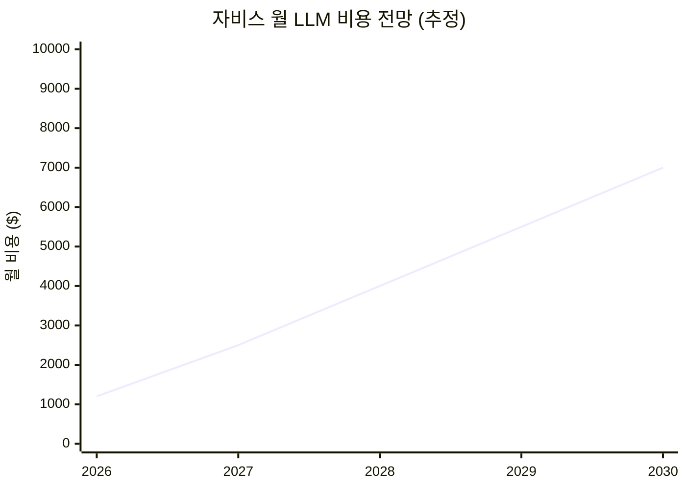

**가정:**
- MAU: 2026년 1,000 → 2030년 10,000 (테넌트 증가)
- 호출당 평균 토큰: 2,000 input / 500 output
- DeepSeek V4-Pro 단가 유지 (경쟁으로 인하 전망)
- RAG 인덱싱: 월 $50~100 (신규 상품/블로그)

### 비용 절감 요인

| 요인 | 절감률 | 적용 시점 |
|------|-------|----------|
| Prompt caching (DeepSeek) | -50~75% | V3 초기 |
| Flash Router (저비용 모델) | -70% (Router 비용) | 현재 |
| 오픈 모델 자체 호스팅 | -80% | V4-V5 |
| Golden set 기반 모델 선택 | -30% (불필요한 Pro 호출 감소) | Phase 4+ |
| Workflow Engine (batch 최적화) | -20% | V4 |

### 효용 측정 지표

| 지표 | 현재 (V2) | V3 목표 | V4 목표 | V5 목표 |
|------|----------|---------|---------|---------|
| Agent 수 | 6개 | 9개 | 12개+ | 20개+ |
| 응답 p50 | ~4s | 3s | 2s | 1s |
| 응답 p95 | ~15s | 10s | 6s | 3s |
| 테넌트 온보딩 | 수동 | 셀프서비스 | 자동 | 즉시 |
| 외부 연동 | 없음 | MCP 게이트웨이 | 마켓플레이스 | 에코시스템 |
| 언어 | 한글 | 한글+영어 | 5개 언어 | 10+ 언어 |
| 가동률 | 99% | 99.5% | 99.9% | 99.99% |

---

## 부록: 코드 파일 맵 (참고)

| 주제 | 파일 | 역할 |
|------|------|------|
| **Engine** | `src/lib/jarvis/deepseek-agent-loop-v2.ts` | V2 DeepSeek streaming loop |
| **Dispatch** | `src/lib/jarvis/v2-dispatch.ts` | Router → agent config 조립 |
| **Router** | `src/lib/jarvis/claude-router.ts` | 메시지 분류 (6 agents) |
| **Orchestration** | `src/lib/jarvis/orchestration/` | 2단 서브 라우팅 |
| **Types** | `src/lib/jarvis/types.ts` | JarvisContext, AgentType 등 |
| **Tenant** | `src/lib/jarvis/persona.ts`, `scoped-client.ts`, `scoped-tables.ts` | 테넌트 격리 |
| **Guest** | `src/lib/jarvis/guest-guardrail.ts`, `auth-resolver.ts` | 게스트 인증+가드레일 |
| **RAG** | `src/lib/jarvis/rag/retriever.ts`, `rag/indexer.ts` | 지식 검색 |
| **Learning** | `src/lib/jarvis/jarvis-lessons.ts`, `fact-extractor.ts`, `response-critic.ts` | 누적 학습 |
| **Admin API** | `src/app/api/jarvis/stream/route.ts`, `approve/route.ts` | SSE + HITL 승인 |
| **Guest UI** | `src/components/jarvis/MagicLinkChat.tsx`, `JarvisSidekick.tsx` | 고객 채팅 위젯 |
| **Design** | `db/JARVIS_V2_DESIGN.md` | V2 상세 설계 |
| **Docs** | `docs/jarvis-orchestration.md`, `docs/platform-ai-roadmap.md` | 기존 문서 |

---

> **문서 변경 이력**
>
> - 2026-05-24 · v1.0 초안 작성. 전수조사 결과 + 사장님 결정 반영. 10년 로드맵 (V3→V5) + Phase 0~9 상세 계획 포함.

